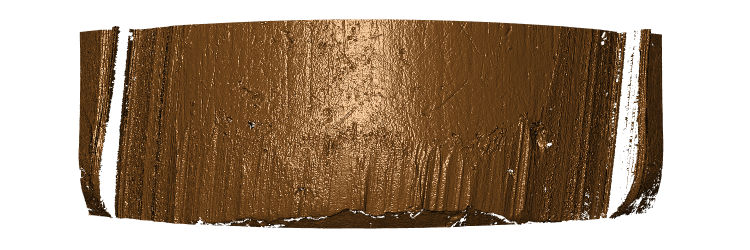
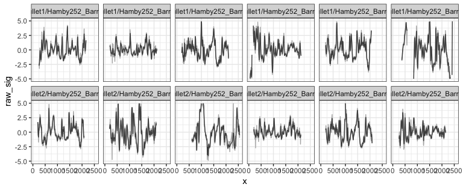
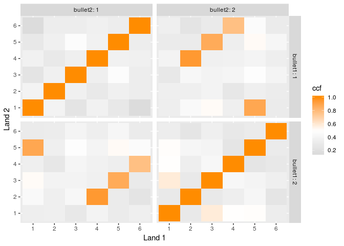

[](https://cran.r-project.org/package=bulletxtrctr) [](http://www.r-pkg.org/pkg/bulletxtrctr) 
[](http://www.repostatus.org/#active)
[](https://travis-ci.org/heike/bulletxtrctr)
[](/commits/master)
[](https://codecov.io/github/heike/bulletxtrctr?branch=master)

Analyze bullet striations using nonparametric methods

# Comparing lands from two bullets

1. Load libraries


```r
  library(dplyr)
  library(bulletxtrctr)
  library(x3ptools)
  library(randomForest)
  library(ggplot2)
```
  
2. `bulletxtrctr` only works on x3p files. See package `x3ptools` at https://heike.github.io/x3ptools/ for ways to convert different file formats into x3p standard files.
The NIST Research Ballistics Toolmarks data base (NRBTD)[https://tsapps.nist.gov/NRBTD/Studies/Search] provides access to  scans of bullets and cartridge cases from various case studies.  

Download some files from NRBTD, if not yet available:


```r
if (!file.exists("README_files/data/Bullet1/Hamby252_Barrel1_Bullet1_Land1.x3p")) {
  NRBTDsample_download("README_files/data")
}
  b1 <- read_bullet("README_files/data/Bullet1", "x3p")
```

```
## 6 files found. Reading ...
```

```r
  b2 <- read_bullet("README_files/data/Bullet2", "x3p")
```

```
## 6 files found. Reading ...
```
Combine the results into a single data frame:


```r
b1$bullet <- 1
b2$bullet <- 2
bullets <- rbind(b1, b2)
```

We expect data to be recorded at the micron level.
The scans posted give measurements in meters:


```r
bullets$x3p[[1]]$header.info$incrementY
```

```
## [1] 1.5625e-06
```

```r
bullets$x3p[[1]]$header.info$incrementX
```

```
## [1] 1.5625e-06
```

```r
summary(as.vector(bullets$x3p[[1]]$surface.matrix))
```

```
##    Min. 1st Qu.  Median    Mean 3rd Qu.    Max.    NA's 
##       0       0       0       0       0       0   24829
```

Change measurements to microns:


```r
bullets <- bullets %>% mutate(
    x3p = x3p %>% purrr::map(.f = function(x) {
      # make sure all measurements are in microns
      x$surface.matrix <- x$surface.matrix*10^6
      x$header.info$incrementY <- x$header.info$incrementY*10^6
      x$header.info$incrementX <- x$header.info$incrementX*10^6
      x
    })
  )
```


We are working under the assumption that the scans are aligned such that the bottom of the bullet (heel) are at the bottom (y = 0) of the image, and the land engraved area is displayed left to right from groove to groove, i.e. we are assuming that (0,0) is in the bottom left corner of the image.  In scans where no adjustment was made for the barrel's twist (not recommended) the twist will be visible in the image.


```r
image_x3p(bullets$x3p[[1]], file = "README_files/temp-before.png")
```

The raw scan needs to be flipped such that the heel is along the bottom of the image rather than along the left hand side.


```r
# turn the scans such that (0,0) is bottom left
bullets <- bullets %>% mutate(
  x3p = x3p %>% purrr::map(.f = function(x) x %>% 
                             rotate_x3p(angle=-90) %>%
                             y_flip_x3p())
  ) 
```


```r
image_x3p(bullets$x3p[[1]], file="README_files//temp-after.png")
```

Scan after the transformation: a clear right twist is visible in the right slant of striae and grooves.



3. Get the ideal cross sections


```r
  bullets <- bullets %>% mutate(
    crosscut = x3p %>% purrr::map_dbl(.f = x3p_crosscut_optimize)
  )
# now extract the crosscuts
  bullets <- bullets %>% mutate(
    ccdata = purrr::map2(.x = x3p, .y = crosscut, 
                         .f = x3p_crosscut)
  )
```

4. Get the groove locations


```r
  bullets <- bullets %>% mutate(
    grooves = ccdata %>% 
      purrr::map(.f = cc_locate_grooves, method = "rollapply", 
                 adjust = 30)
 #         purrr::map(.f = cc_locate_grooves, method = "quadratic")
  #    purrr::map(.f = cc_locate_grooves, method = "middle", middle=80)
  )

bullets$grooves[[1]]
```

```
## $groove
## [1]  246.875 2159.375
```

5. Extract signatures


```r
bullets <- bullets %>% mutate(
  sigs = purrr::map2(
    .x = ccdata, .y = grooves, 
    .f = function(x, y) {
      cc_get_signature(
        ccdata=x, grooves = y, span1 = 0.75, span2=0.03)
      })
)
```


```r
signatures <- bullets %>% select(source, sigs) %>% tidyr::unnest()
signatures %>% 
  filter(!is.na(sig),!is.na(raw_sig)) %>%
  ggplot(aes(x = x)) + 
  geom_line(aes(y = raw_sig), colour = "grey70") +
  geom_line(aes(y = sig), colour="grey30") +
  facet_wrap(~source, ncol=6) +
  ylim(c(-5,5)) +
  theme_bw()
```

<!-- -->

8. Detect peaks and valleys in the aligned signatures


```r
  lands <- unique(bullets$source)
  comparisons <- data.frame(
    expand.grid(b1=lands, b2=lands), stringsAsFactors = FALSE)
#  comparisons <- comparisons %>% filter(b1 != b2)
  
  comparisons <- comparisons %>% mutate(
    aligned = purrr::map2(.x = b1, .y = b2, .f = function(xx, yy) {
      land1 <- bullets$sigs[bullets$source==xx][[1]]
      land2 <- bullets$sigs[bullets$source==yy][[1]]
   #  land1$bullet <- "first-land"
   #  land2$bullet <- "second-land"
      
      sig_align(land1$sig, land2$sig)
    })
  )
```
Some features are based on aligned signatures:


```r
comparisons <- comparisons %>% mutate(
  ccf0 = aligned %>% 
    purrr::map_dbl(.f = function(x) extract_feature_ccf(x$bullet)),
  lag0 = aligned %>% 
    purrr::map_dbl(.f = function(x) extract_feature_lag(x$bullet)),
  D0 = aligned %>% 
    purrr::map_dbl(.f = function(x) extract_feature_D(x$bullet)),
  length0 = aligned %>% 
    purrr::map_dbl(.f = function(x) extract_feature_length(x$bullet)),
  overlap0 = aligned %>% 
    purrr::map_dbl(.f = function(x) extract_feature_overlap(x$bullet))
)
```

Other features also need an evaluation of peaks and valleys to match between signatures:


```r
  comparisons <- comparisons %>% mutate(
    results = aligned %>% purrr::map(.f = sig_cms_max, span = 75) 
  )
```


```r
## ccf and lag are extracted below
# comparisons <- comparisons %>% mutate(
#   ccf = results %>% purrr::map_dbl(.f = function(x) x$ccf),
#   lag = results %>% purrr::map_dbl(.f = function(x) x$lag) #,
# #  cms = results %>% purrr::map_dbl(.f = function(x) x$maxCMS)
# )
comparisons <- comparisons %>% mutate(
  barrel1 = gsub(".*Barrel([1-6])_.*","\\1",b1),
  barrel2 = gsub(".*Barrel([1-6])_.*","\\1",b2),
  bullet1 = gsub(".*Bullet([1-6])_.*","\\1",b1),
  bullet2 = gsub(".*Bullet([1-6])_.*","\\1",b2),
  land1 = gsub(".*Land([1-6]).x3p","\\1",b1),
  land2 = gsub(".*Land([1-6]).x3p","\\1",b2)
)
```

9. Extract Features


```r
comparisons <- comparisons %>% mutate(
  features = results %>% purrr::map(.f = extract_features_all)
)

comparisons <- comparisons %>% tidyr::unnest(features)

# quick visualization:
comparisons %>% 
  ggplot(aes(x = land1, y = land2, fill=ccf)) +
  geom_tile() +
  scale_fill_gradient2(low="grey80", high = "darkorange", 
                       midpoint = 0.5) +
  facet_grid(bullet1~bullet2, labeller="label_both") +
  xlab("Land 1") +
  ylab("Land 2")
```

<!-- -->
    

10. Get Predicted Probability of Match


```r
  comparisons$rfscore <- predict(bulletr::rtrees, newdata = comparisons, type = "prob")[,2]

comparisons %>% 
  ggplot(aes(x = land1, y = land2, fill=rfscore)) +
  geom_tile() +
  scale_fill_gradient2(low="grey80", high = "darkorange", 
                       midpoint = .5) +
  facet_grid(bullet1~bullet2, labeller="label_both") +
  xlab("Land 1") +
  ylab("Land 2")
```

<!-- -->
    

An interactive interface for doing comparisons is available https://oaiti.org/apps/bulletmatcher/
