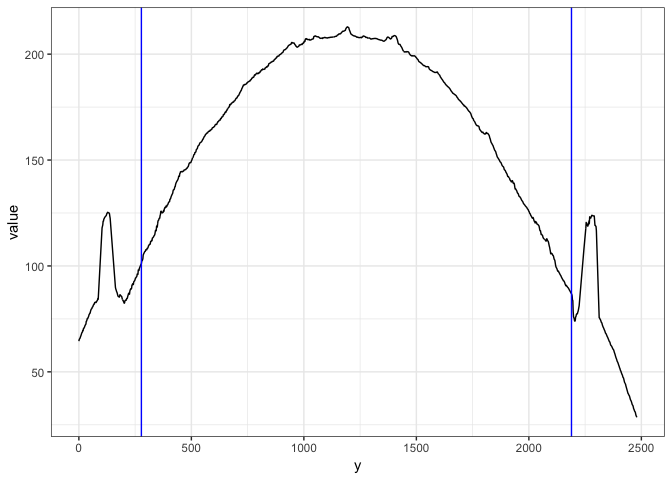
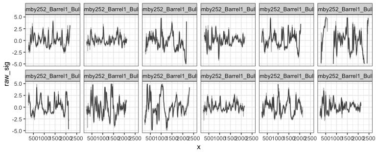
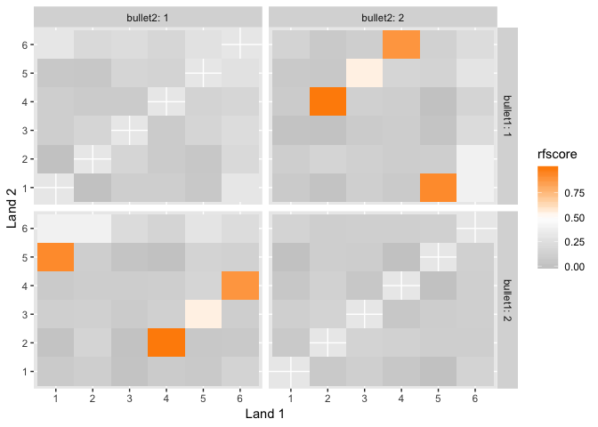

[](https://cran.r-project.org/package=bulletxtrctr) [](http://www.r-pkg.org/pkg/bulletxtrctr) 
[](http://www.repostatus.org/#active)
[](https://travis-ci.org/isu-csafe/bulletxtrctr)
[](/commits/master)


Analyze bullet striations using nonparametric methods

# Comparing two lands

## HOW-TO

1. Load libraries


```r
  library(dplyr)
  library(bulletxtrctr)
  library(x3ptools)
  library(randomForest)
  library(ggplot2)
```
  
2. Download some files from NRBTDB, if not yet available:


```r
if (!file.exists("data/Bullet1/Hamby252_Barrel1_Bullet1_Land1.x3p")) {
  NRBTDsample_download("data")
}
  b1 <- read_bullet("data/Bullet1", "x3p")
```

```
## 6 files found. Reading ...
```

```r
  b2 <- read_bullet("data/Bullet2", "x3p")
```

```
## 6 files found. Reading ...
```
Combine the results into a single data frame:

```r
b1$bullet <- 1
b2$bullet <- 2
bullets <- rbind(b1, b2)

# turn the scans such that (0,0) is bottom left
bullets <- bullets %>% mutate(
  x3p = x3p %>% purrr::map(.f = function(x) x %>% 
                             rotate_x3p(angle=-90) %>%
                             y_flip_x3p())
  ) %>% mutate(
    x3p = x3p %>% purrr::map(.f = function(x) {
      # make sure all measurements are in microns
      x$surface.matrix <- x$surface.matrix*10^6
      x$header.info$incrementY <- x$header.info$incrementY*10^6
      x$header.info$incrementX <- x$header.info$incrementX*10^6
      x
    })
  )
```

3. Get the ideal cross sections


```r
  bullets <- bullets %>% mutate(
    crosscut = x3p %>% purrr::map_dbl(.f = x3p_crosscut_optimize)
  )
```

```
## Warning in simpleLoess(y, x, w, span, degree = degree, parametric =
## parametric, : k-d tree limited by memory. ncmax= 473
```

```
## Warning in simpleLoess(y, x, w, span, degree = degree, parametric =
## parametric, : k-d tree limited by memory. ncmax= 512
```

```r
# now extract the crosscuts
  bullets <- bullets %>% mutate(
    ccdata = purrr::map2(.x = x3p, .y = crosscut, 
                         .f = x3p_crosscut)
  )
```

4. Get the groove locations


```r
  bullets <- bullets %>% mutate(
    grooves = ccdata %>% purrr::map(.f = cc_locate_grooves, method = "middle")
  )

bullets$grooves[[1]]
```

```
## $groove
##    12.5%    87.5% 
##  337.500 2129.688 
## 
## $plot
```

<!-- -->

5. Extract signatures


```r
bullets <- bullets %>% mutate(
  sigs = purrr::map2(
    .x = ccdata, .y = grooves, 
    .f = function(x, y) {
      cc_get_signature(ccdata=x, grooves = y, span1 = 0.75, span2=0.03)})
)
```


```r
signatures <- bullets %>% select(source, sigs) %>% tidyr::unnest()
signatures %>% 
  filter(!is.na(sig),!is.na(raw_sig)) %>%
  ggplot(aes(x = x)) + 
  geom_line(aes(y = raw_sig), colour = "grey70") +
  geom_line(aes(y = sig), colour="grey30") +
  facet_wrap(~source, ncol=6) +
  ylim(c(-5,5)) +
  theme_bw()
```

<!-- -->

8. Detect peaks and valleys in the aligned signatures


```r
  lands <- unique(bullets$source)
  comparisons <- data.frame(
    expand.grid(b1=lands, b2=lands), stringsAsFactors = FALSE)
  comparisons <- comparisons %>% filter(b1 != b2)
  
  comparisons <- comparisons %>% mutate(
    results = purrr::map2(.x = b1, .y = b2, .f = function(xx, yy) {
      land1 <- bullets$sigs[bullets$source==xx][[1]]
      land2 <- bullets$sigs[bullets$source==yy][[1]]
      land1$bullet <- "first-land"
      land2$bullet <- "second-land"
      
      sig_cms_max(land1, land2, column="sig", span = 25)
    })
  )
```


```r
comparisons <- comparisons %>% mutate(
  ccf = results %>% purrr::map_dbl(.f = function(x) x$ccf),
  lag = results %>% purrr::map_dbl(.f = function(x) x$lag),
#  cms = results %>% purrr::map_dbl(.f = function(x) x$maxCMS)
)
comparisons <- comparisons %>% mutate(
  barrel1 = gsub(".*Barrel([1-6])_.*","\\1",b1),
  barrel2 = gsub(".*Barrel([1-6])_.*","\\1",b2),
  bullet1 = gsub(".*Bullet([1-6])_.*","\\1",b1),
  bullet2 = gsub(".*Bullet([1-6])_.*","\\1",b2),
  land1 = gsub(".*Land([1-6]).x3p","\\1",b1),
  land2 = gsub(".*Land([1-6]).x3p","\\1",b2)
)

# quick visualization:
comparisons %>% 
  ggplot(aes(x = land1, y = land2, fill=ccf)) +
  geom_tile() +
  scale_fill_gradient2(low="grey80", high = "darkorange", 
                       midpoint = 0.5) +
  facet_grid(bullet1~bullet2, labeller="label_both") +
  xlab("Land 1") +
  ylab("Land 2")
```

<!-- -->

9. Extract Features


```r
comparisons <- comparisons %>% mutate(
  features = results %>% purrr::map(.f = function(res) {
    lofX <- res$bullets
#    lofX$l30 <- lofX$sig
#    b12 <- unique(lofX$bullet)
    b12 <- c("sig1", "sig2")
  subLOFx1 <- lofX[,c("x", "sig1")]
  names(subLOFx1) <- c("y", "val")
  subLOFx2 <- lofX[,c("x", "sig2")]
  names(subLOFx2) <- c("y", "val")
#    browser()
    
 #   subLOFx1 <- subset(lofX, bullet==b12[1])
  #  subLOFx2 <- subset(lofX, bullet==b12[2]) 

    ys <- dplyr::intersect(round(subLOFx1$y, digits = 3), round(subLOFx2$y, digits = 3))

    idx1 <- which(round(subLOFx1$y, digits = 3) %in% ys)
    idx2 <- which(round(subLOFx2$y, digits = 3) %in% ys)

    g1_inc_x <- 1.5625
    
    distr.dist <- sqrt(mean(((subLOFx1$val[idx1] - subLOFx2$val[idx2]) * g1_inc_x / 1000)^2, na.rm=TRUE))
    distr.sd <- sd(subLOFx1$val * g1_inc_x / 1000, na.rm=TRUE) + sd(subLOFx2$val * g1_inc_x / 1000, na.rm=TRUE)

    km <- which(res$lines$match)
    knm <- which(!res$lines$match)
    if (length(km) == 0) km <- c(length(knm)+1,0)
    if (length(knm) == 0) knm <- c(length(km)+1,0)

    signature.length <- min(nrow(subLOFx1), nrow(subLOFx2))

    doublesmoothed <- lofX %>% 
      tidyr::gather(bullet, l30, sig1:sig2) %>%
   #   group_by(y) %>%
      mutate(avgl30 = mean(l30, na.rm = TRUE)) %>%
      ungroup() %>%
      mutate(smoothavgl30 = bulletr:::smoothloess(x = x, y = avgl30, span = 0.3),
             l50 = l30 - smoothavgl30)

    final_doublesmoothed <- doublesmoothed %>%
      filter(round(x, digits = 3) %in% ys)

    rough_cor <- cor(final_doublesmoothed$l50[final_doublesmoothed$bullet == b12[1]], 
                     final_doublesmoothed$l50[final_doublesmoothed$bullet == b12[2]],
                     use = "pairwise.complete.obs")

    data.frame(
      ccf=res$ccf, 
      rough_cor = rough_cor, 
      lag=res$lag / 1000, 
      D=distr.dist, 
      sd_D = distr.sd,
 #     b1=b12[1], b2=b12[2],
      signature_length = signature.length * g1_inc_x / 1000,
      overlap = length(ys) / signature.length,
      matches = sum(res$lines$match) * (1000 / g1_inc_x) / length(ys),
      mismatches = sum(!res$lines$match) * 1000 / abs(diff(range(c(subLOFx1$y, subLOFx2$y)))),
      cms = res$maxCMS * (1000 / g1_inc_x) / length(ys),
      cms2 = bulletr::maxCMS(subset(res$lines, type==1 | is.na(type))$match) * (1000 / g1_inc_x) / length(ys),
      non_cms = bulletr::maxCMS(!res$lines$match) * 1000 / abs(diff(range(c(subLOFx1$y, subLOFx2$y)))),
      left_cms = max(knm[1] - km[1], 0) * (1000 / g1_inc_x) / length(ys),
      right_cms = max(km[length(km)] - knm[length(knm)],0) * (1000 / g1_inc_x) / length(ys),
      left_noncms = max(km[1] - knm[1], 0) * 1000 / abs(diff(range(c(subLOFx1$y, subLOFx2$y)))),
      right_noncms = max(knm[length(knm)]-km[length(km)],0) * 1000 / abs(diff(range(c(subLOFx1$y, subLOFx2$y)))),
      sum_peaks = sum(abs(res$lines$heights[res$lines$match]), na.rm=TRUE) * (1000 / g1_inc_x) / length(ys)
) 
  })
)
```
    

10. Get Predicted Probability of Match


```r
  comparisons <- comparisons %>% tidyr::unnest(features)
  comparisons$rfscore <- predict(bulletr::rtrees, newdata = comparisons, type = "prob")[,2]

comparisons %>% 
  ggplot(aes(x = land1, y = land2, fill=rfscore)) +
  geom_tile() +
  scale_fill_gradient2(low="grey80", high = "darkorange", 
                       midpoint = .5) +
  facet_grid(bullet1~bullet2, labeller="label_both") +
  xlab("Land 1") +
  ylab("Land 2")
```

<!-- -->
    

An interactive interface for doing comparisons is available https://oaiti.org/apps/bulletmatcher/
